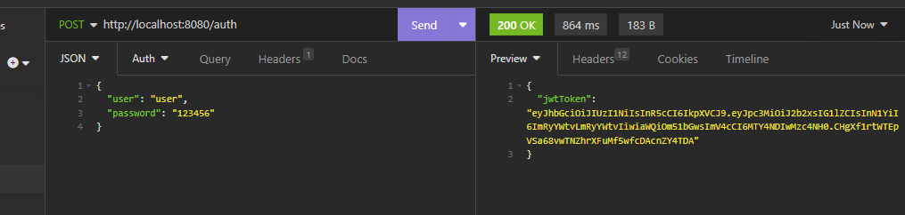
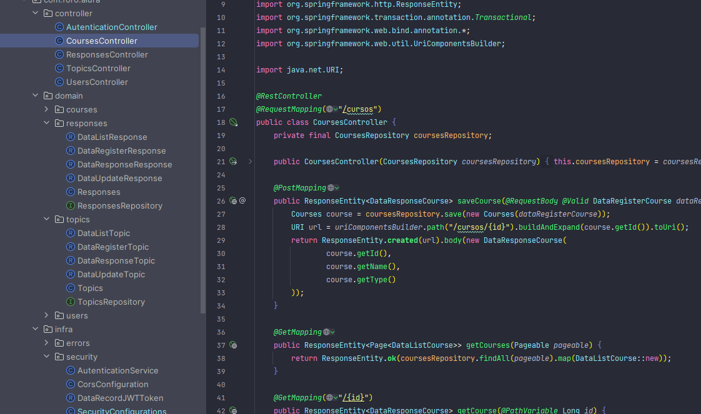
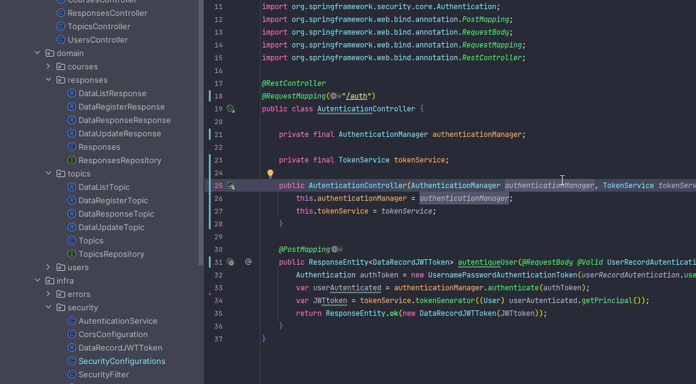

## Chagllenge 4: Foro Alura

### Descripción

Esta aplicación está diseñada para administrar un hotel, en el cual se pueden registrar clientesy reservas, es posible registrar una reserva y añadir uno o más clientes a la misma, también permite la edición y eliminación de reservas y clientes.

Esta aplicación está desarrollada sirve un API REST, la cual se puede consumir desde cualquier cliente REST, para el desarrollo de la aplicación se utilizó el framework Spring Boot, el cual permite el desarrollo de aplicaciones web de manera rápida y sencilla, también se utilizó el framework Hibernate para el mapeo de las entidades y la conexión con la base de datos, la base de datos utilizada es Postgrest SQL.

### Instalación

Para la instalación de la aplicación es necesario tener instalado Java 8 o superior, también es necesario tener instalado Postgrest SQL, las migraciones de la base de datos se generan con flyware, para la instalación de la base de datos se debe crear una base de datos con el nombre forodb, también se empaqueta en un archivo .war para su despliegue en un servidor como tomcat.

### Uso

La aplicación permite realiza todas las operaciones CRUD que podrían esperarse de una aplicación de este tipo, los endpoints son los siguientes:

- POST: http://localhost:8080/enpoint
- GET: http://localhost:8080/enpoint
- GET: http://localhost:8080/enpoint/{id}
- PUT: http://localhost:8080/enpoint
- DELETE: http://localhost:8080/enpoint/{id}

Los endpoints son los siguientes:

- cursos
- usuarios
- topicos
- respuestas

### Seguridad

La aplicación cuenta con un filtro de seguridad basado en tokens, es necesario realizar un login para generan un token de acceso, el token de acceso se debe enviar en el header de la petición con el nombre Authorization, el token de acceso tiene una duración de 1 hora, el token de acceso se genera con el endpoint:

- POST: http://localhost:8080/auth

```json
{
    "user": "user",
    "password": "password"
}
```


Para cambiar el usuario y la contraseña se debe modificar el archivo application.properties, en el cual se encuentran las propiedades de la base de datos, la contraseña se almacena encriptada en la base de datos, para encriptar la contraseña se debe utilizar el endpoint:

- POST: http://localhost:8080/cript

```json
{
    "password": "password"
}
```

### Herraminetas

#### Algunas de las herramientas utilizadas para el desarrollo de la aplicación son las siguientes:

- Spring Boot
- Hibernate
- Postgrest SQL
- Flyware
- Maven
- Java 17
- Tomcat
- Insonmia
- Git

<div align="center">


</div>

  
### Acerca de

Este proyecto fue realizado para el Challenge de ALURA by Oracle Mayo 2023. ✔


- Twitter [@drako9159](https://twitter.com/Drako9159)
- Sitio [@Web](https://www.drako.icu)
- Linkedin [Antonio Jaramillo](https://www.linkedin.com/in/antonio-jaramillo-099a77250)